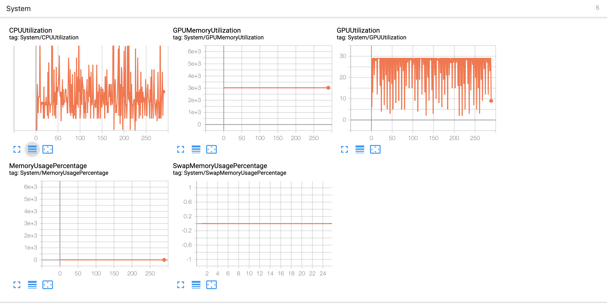

## GlobalSummaryWriter


A super small wrapper around [TensorboardX](https://github.com/lanpa/tensorboardX) `SummaryWriter` to automatically log system metrics.

Included metrics for now :

1. CPUUtilization
2. GPUMemoryUtilization
3. GPUUtilization
4. MemoryUsagePercentage 
4. SwapMemoryUsagePercentage


### Requirements 

1. [TensorboardX](https://github.com/lanpa/tensorboardX)
2. [PSUTIL](https://psutil.readthedocs.io/en/latest/)

### Installation 

Add `GlobalSummaryWriter.py` to your project 

```python
writer = SummaryWriter()
writer.log_system_metrics(global_step=)
```


### Screenshot 




### Motivation 

Floydub & CometML Automatically gather these information & graph them , so why not ?